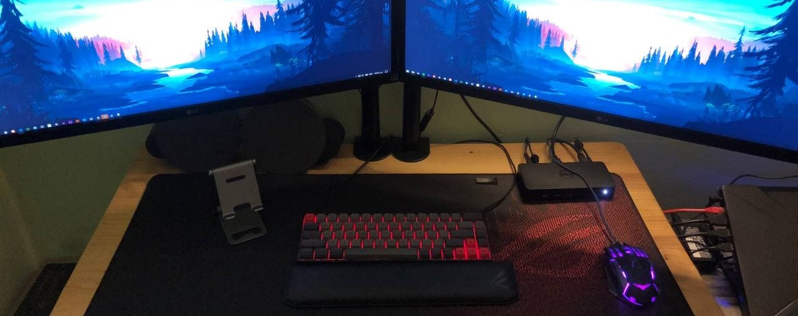

## Hi there 👋, I'm Manuel Castillo

### 👨🏻‍💻 About Me

* 🌮 I'm from Puebla, Mexico.
* 👨🏻‍💻 Studied BS(Computer Science).
* 🐍 I'm currently more about Python.
* 📐 Continuously learning _Mathematics_.
* 🖤 My hobbies:
  * 🥋 Karate
  * 🥋 Tae Kwon Do
  * 🏐 Voleyball
  * 🤩 Watch anime
  * 🎶 Listen music
  * 📖 Read horror books

### 🤝🏻 Connect with me

<a href="https://instagram.com/nuelcodes"></a>&nbsp;
<a href="https://www.linkedin.com/in/nuelcodes/"></a>&nbsp;
<a href="mailto:nuelcastillo@icloud.com?subject=Hola%20Manuel"></a>

```js

document.write("Hello World!");

var status = 
{
    working     :[Web Developer],    
    learning    :[Data Science, Machine Learning & MongoDB]
}

const skills =
{
    languajes   :[Python, HTML, CSS, JavaScript, PHP, R],

    databases   :[Sqlite, MySql],

    ide         :[Visual Studio Code, PyCharm, Jupyter Notebook],

    libraries   :[Jquery, Numpy, Pandas, Sklearn, Matplotlib, Tkinter, Grocery CRUD],

    framework   :[Bootstrap, Node, Django, Flask, CodeIgniter, Materialize],

    platforms   :[GitHub Pages, Pythonanywhere]
}

Developer dev = new Developer(@nuelcodes);

while(dev.isCoding() && dev.isStuck())  
{
  dev.openFireFoxBrowser();
  dev.openStackOverFlow();
  dev.copyCodeFromStackOverFlow();
  dev.pasteCodeInIde();
  dev.feelProfessional();
}

```

 